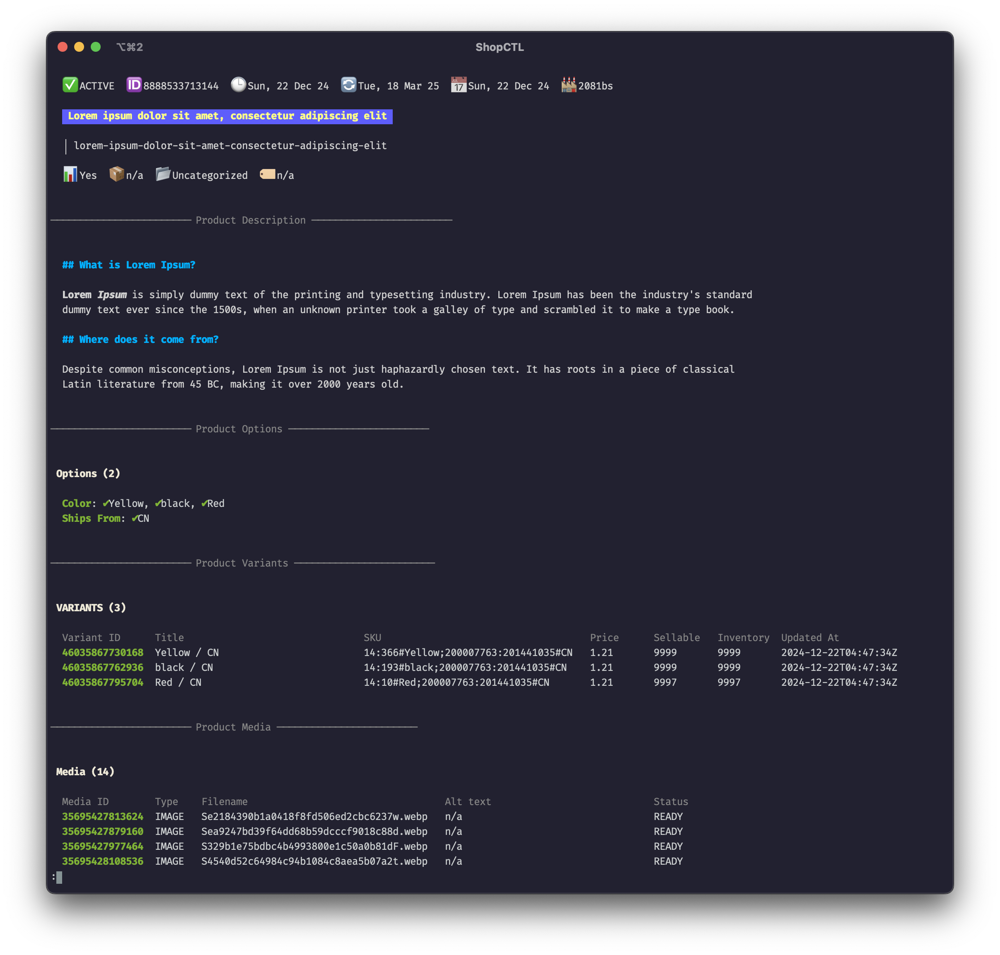

<div align="center">
    <h1 align="center">ShopCTL</h1>
</div>

<div>
    <p align="center">
        <i>[WiP] Command-line backup, restore, and inspection utility for Shopify</i>
    </p>
    <br/><br/>
</div>

ShopCTL is a (slightly opinionated) work-in-progress command line utility for Shopify data management. It enables you to backup and restore Shopify resources locally,
eliminating the need to route your data through third-party plugins. It comes with a few handy commands to quickly peek and inspect your data,
and gives you a straightforward way to manage your store's data straight from the terminal.

> This tool is currently a work in progress and not production ready but it works!

## Installation

Create a dummy app from the [Shopify partners dashboard](https://partners.shopify.com/) and get the client ID and secret. Make sure you've [required scopes](https://github.com/ankitpokhrel/shopctl/blob/main/internal/oauth/oauth.go#L35-L47).

Install the runnable binary to your `$GOPATH/bin`.

```go
SHOPCTL_CLIENT_ID=<id> SHOPCTL_CLIENT_SECRET=<secret> go install github.com/ankitpokhrel/shopctl/cmd/shopctl@main
```

`shopctl` will be available as a packaged downloadable binary for different platforms later.

## Getting started

### Authentication

Before you begin using ShopCTL, you need to configure your store(s). ShopCTL supports managing multiple Shopify stores by using contexts
— each representing a store — and by allowing you to define backup strategies for each store.

You can either directly use the access token or login to your store using the oAuth flow.

#### Direct Access Token

If you already have an access token you can set it directly to your shell session. Note that your token needs to have [access to resources](https://github.com/ankitpokhrel/shopctl/blob/main/internal/oauth/oauth.go#L35-L47) you're trying to backup/restore.

```
SHOPIFY_ACCESS_TOKEN=<token>
```

#### OAuth

You can log in to your Shopify store using the store's MyShopify URL and would need to assign a unique alias (context name) for that store.
This will generate the config and create a new context in your configuration file.

```sh
# Login to first store
$ shopctl auth login --store mystore1.myshopify.com --alias store1

# Login to another store
$ shopctl auth login -s mystore2.myshopify.com -a store2
```

**Note**: Generated access token is saved in Keyring if available, else, it will be stored as a plain text in your config file. Support for the `.netrc` might be added later.

### Quick usage
For the simple usecase, authentication is all you need to get started. You can now run adhoc commands like below to backup and restore items. Check [Usage](#usage) section for
details on dvance usage.

```sh
# Run backup for store1 and backup all products with tags 'on-sale' and 'premium' and customers created in 2025
$ shopctl backup run -c store1 -r product="tag:on-sale AND tag:premium" -r customer=created_at:>=2025-01-01 -o /path/to/bkp

# Restore from the backup we generated above but only restore customers with verified email
$ shopctl restore run -c store1 -r --backup-path /path/to/bkp -r product -r customer=verifiedEmail:true
```

## Config Management

ShopCTL lets you manage multiple stores. That means you'd need to define presets so that you can easily run the tool for multiple stores.

The config manager is inspired by the [k8s/kubectl](https://github.com/kubernetes/kubectl) CLI and make use of `context` which represents
a store in this case. Contexts are auto-created when you login to the store with `shopctl auth login` command mentioned above.

Here is a simple example of how we can define the config.

First, let's switch to the context corresponding to the store we want to work with. For example, to set `store1` as the current active context:

```sh
# We already logged in to store1 in authentication step
# We're now going to use 'store1' as our current store
$ shopctl config use-context store1
```

Now, let's define some backup strategy. A backup strategy defines what resources to back up, where to store the backups, and additional parameters such as backup prefix.
With your desired context active (in this case, `store1`), add one or more backup strategies as shown below.

```sh
# Daily product backup
$ shopctl config set-strategy daily --dir /path/to/backups/daily --resources product

# Weekly backup for all products and verified customers
$ shopctl config set-strategy weekly -d /path/to/backups/weekly -r product="productType:clothing AND category:T-Shirts" -r customer=verifiedEmail:true --prefix wk_
```

We defined 2 strategies above; daily and weekly. Let's set the current active strategy to `daily`.

```sh
shopctl config use-strategy daily
```

With the active context and strategy configured, you can now run your backup. The command below will execute the backup for `store1`
using the `daily` strategy we defined above:

```sh
shopctl backup run
```

You can also manually pass context/strategy flag to quickly run other configured strategies.

```sh
# Run backup for store1 weekly strategy
$ shopctl backup run -s weekly

# Run backup for store2 regardless of current default store
$ shopctl backup run -c store -s store2-strategy
```

See `shopctl config -h` for all available config commands.

#### Shell completion
Check `shopctl completion --help` for details on setting up a bash/zsh shell completion.

## Usage
The tool currently supports product and customer sync. The backup command supports filtering with [Shopify Search](https://shopify.dev/docs/api/usage/search-syntax) query.
```sh
shopctl backup run -c mycontext -r product="tag:on-sale AND tag:premium" -r customer=created_at:>=2025-01-01 -o /path/to/bkp
```

## Commands
### Backup
The `backup` command lets you backup different Shopify resources. The tool currently supports product and customer sync.

#### Run
The `run` command executes backup action based on current config. You can also use the command to run quick adhoc backups.

```sh
# Run backup for configured store
$ shopctl backup run

# Run monthly backup for store2
$ shopctl backup run -c store2 -s monthly

# Adhoc backup run for store1
$ shopctl backup run -c store1 -r product="tag:on-sale AND tag:premium" -o /path/to/bkp

# Dry run will executes all query but won't create backup files
$ shopctl backup run --dry-run
```

The `--resources/-r` flag supports [Shopify API search syntax](https://shopify.dev/docs/api/usage/search-syntax)

#### List
The `list` command lists all available backups for the store. Note that backups from adhoc runs are not included.

```sh
# List backups for current context
$ shopctl backup list

# List weekly backups for store2
$ shopctl backup list -c store2 -s weekly
```

### Restore
The `restore` command lets you restore Shopify resources backed up using the `backup` command.

#### Run
The `restore` command executes restore/sync action. This operation will try to make the resource as similar as to the one you have in the backup. That means if you have 3 variants in your store and the backup has 2, the extra one will be removed. Since the operation is destructive please make sure you know what you're doing or have a backup.


```sh
# Restore everything for the current store from the latest backup
$ shopctl restore run --latest --all

# Restore some products on status DRAFT for the context from the latest backup
$ shopctl restore run --latest -r product="id:id1,id2,id3 AND status:DRAFT"

# Restore everything for the context from the given backup id
# You can get backup id using the `backup list` command
$ shopctl restore run --backup-id 3820045c0c --all

# Restore all products from the given context and backup id
$ shopctl restore run -c mycontext --backup-id 3820045c0c -r product

# Restore specific products from the latest backup of the given context and strategy
$ shopctl restore run -c mycontext -s mystrategy --latest -r product="id:id1,id2,id3"

# Restore specific products and verified customers from the latest backup
$ shopctl restore run --latest -r product="tags:premium,on-sale" -r customer="verifiedemail:true"

# Restore products and customers directly from the given backup path
$ shopctl restore run --backup-path /path/to/unzipped/bkp -r product -r customer

# Dry run executes the restoration process and print logs without making an actual API call
$ shopctl restore run --latest --all --dry-run
$ shopctl restore run -r product --backup-id 3820045c0c --dry-run -vvv
```

The `--resources/-r` flag also supports filtering but is different from the backup. You can currently filter by fields like id, status, tags, etc.

### Peek
The `peek` command gives you a quick glance into Shopify resources right from your terminal.

#### Product
The `product` command lets you peek a product either from upstream or local backups.

```sh
# Peek by id
$ shopctl peek product <product_id>

# Peek a product from a backup using backup id
$ shopctl peek product <product_id> -b <backup_id>

# Peek a product from the backup folder
# Context and strategy is skipped for direct path
$ shopctl peek product <product_id> --from </path/to/backup>

# Render json output
$ shopctl peek product <product_id> --json
```



### Compare
The `compare` (aliased as `cmp`/`diff`) command gives you a quick look on what data has changed between 2 backups or upstream data.

#### Product
The `product` command lets you compare data between 2 products.

```sh
# Compare with the upstream
$ shopctl cmp product --id <product_id> --with </path/to/bkp>

# Compare data between two backups
$ shopctl cmp product --id <product_id> --from </path/to/bkp/v1> --with </path/to/bkp/v2>
```


The diff is generated in unified diff format using the Myers diff algorithm. Therefore, you can use other tui based diff tools to  custom diff tools like [delta](https://github.com/dandavison/delta), [diff-so-fancy](https://github.com/so-fancy/diff-so-fancy), [nvimdiff](https://neovim.io/doc/user/diff.html), etc. The tool respects `GIT_EXTERNAL_DIFF` env if thats set. A `SHOPIFY_DIFF_TOOL` env is also available if you want to change diff tool just for the ShopCTL.

## Development
1. Clone the repo.
   ```sh
   git clone git@github.com:ankitpokhrel/shopctl.git
   ```

2. Setup a dummy Shopify App since we need app tokens for development.
   ```sh
   export SHOPCTL_CLIENT_ID=<id>
   export SHOPCTL_CLIENT_SECRET=<secret>
   ```
   
4. Make changes, build the binary, and test your changes.
   ```sh
   make deps install
   ```

5. Run CI steps locally before submitting a PR.
   ```sh
   make ci
   ```
